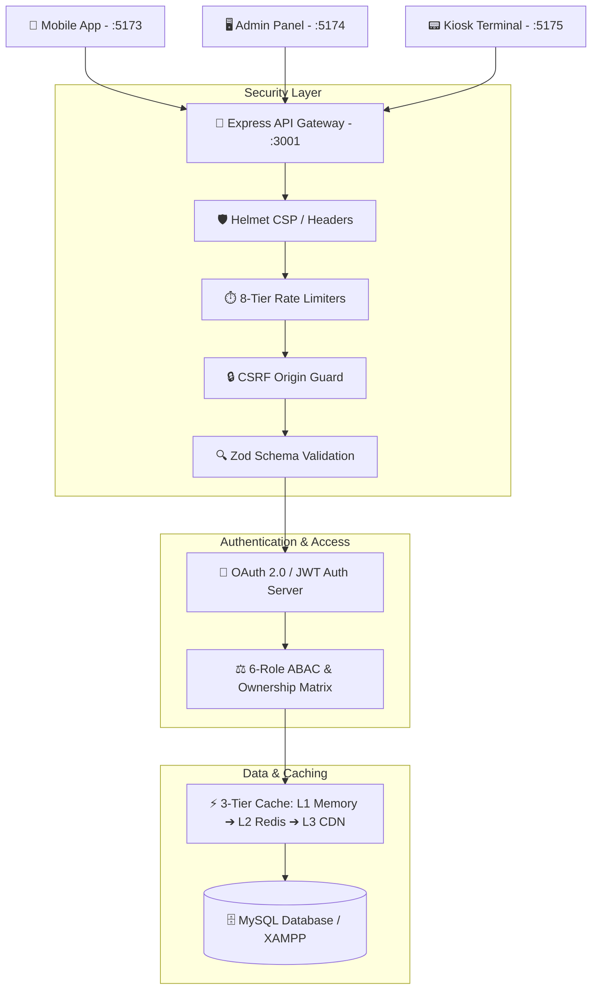

# 🛡️ Waste2Goods — Security Architecture & Source Code Directory Map

This guide provides a **complete index of where all security mechanisms, authentication flows, access control policies, caching tiers, and application code are located** across the Waste2Goods monorepo.

---

## 🧭 Monorepo Architecture Overview



---

## 📂 Master Security & Code Map by Feature

| Feature Category | Primary Source File | Key Exports / Functions | Purpose & Description |
|---|---|---|---|
| **JWT Auth & Token Hardening** | [`packages/backend/src/security/auth-jwt.js`](file:///c:/Users/USER/Downloads/Gamified%20Recycling%20Platform%20Prototype/packages/backend/src/security/auth-jwt.js) | `signAccessToken`, `issueRefreshToken`, `rotateRefreshToken`, `authenticateJWT` | 15-min JWT access tokens, 7-day rotating refresh tokens with reuse detection and family revocation. |
| **OAuth 2.0 Auth Server & PKCE** | [`packages/backend/src/security/oauth2-server.js`](file:///c:/Users/USER/Downloads/Gamified%20Recycling%20Platform%20Prototype/packages/backend/src/security/oauth2-server.js) | `oauth2RouterAttach`, `oauthDiscovery`, `getOAuthClients` | RFC 6749 Authorization Server + RFC 7636 PKCE (`S256` SHA-256 code challenge verification). |
| **Google OAuth 2.0** | [`packages/backend/src/security/google-oauth.js`](file:///c:/Users/USER/Downloads/Gamified%20Recycling%20Platform%20Prototype/packages/backend/src/security/google-oauth.js) | `attachGoogleOAuth`, `googleOAuthInfo` | Handles Google OAuth login, CSRF state verification, user creation, and mobile app token redirection. |
| **GitHub OAuth 2.0** | [`packages/backend/src/security/github-oauth.js`](file:///c:/Users/USER/Downloads/Gamified%20Recycling%20Platform%20Prototype/packages/backend/src/security/github-oauth.js) | `attachGitHubOAuth`, `githubOAuthInfo` | Handles GitHub OAuth login, CSRF state verification, and token exchange. |
| **OAuth User Store** | [`packages/backend/src/security/oauth-user-store.js`](file:///c:/Users/USER/Downloads/Gamified%20Recycling%20Platform%20Prototype/packages/backend/src/security/oauth-user-store.js) | `findOrCreateOAuthUser`, `lookupKioskUser` | Auto-provisions new OAuth users into MySQL with 50 Welcome Points and default address. |
| **ABAC & Role Authorization** | [`packages/backend/src/security/authorization.js`](file:///c:/Users/USER/Downloads/Gamified%20Recycling%20Platform%20Prototype/packages/backend/src/security/authorization.js) | `requirePermission`, `requireOwnershipOrRole`, `hasPermission` | 6-role policy matrix across 11 resources; enforces user ownership (`userId` match) and barangay isolation. |
| **8-Tier Rate Limiting** | [`packages/backend/src/security/rate-limit.js`](file:///c:/Users/USER/Downloads/Gamified%20Recycling%20Platform%20Prototype/packages/backend/src/security/rate-limit.js) | `globalLimiter`, `authLimiter`, `authFailureLimiter`, `writeLimiter` | Protects endpoints against DDoS and brute force (e.g. 5 failed logins triggers account lockout). |
| **CSRF Defense** | [`packages/backend/src/security/csrf.js`](file:///c:/Users/USER/Downloads/Gamified%20Recycling%20Platform%20Prototype/packages/backend/src/security/csrf.js) | `csrfOriginGuard`, `originAllowed`, `extractOrigin` | Rejects mutating requests (POST/PUT/DELETE) originating from untrusted/cross-site origins. |
| **Input Validation (Zod)** | [`packages/backend/src/security/validate.js`](file:///c:/Users/USER/Downloads/Gamified%20Recycling%20Platform%20Prototype/packages/backend/src/security/validate.js) | `validateBody`, `RegisterSchema`, `LoginSchema`, `TransactionSchema` | Strictly validates incoming request payloads before reaching controller logic, preventing injection. |
| **3-Tier Caching** | [`packages/backend/src/security/cache.js`](file:///c:/Users/USER/Downloads/Gamified%20Recycling%20Platform%20Prototype/packages/backend/src/security/cache.js) | `cacheRoute`, `CacheBust`, `cacheStats` | Multi-tier caching for rewards/leaderboards with automatic invalidation on mutation. |
| **Redis / Memory Cache Client** | [`packages/backend/src/security/redis-client.js`](file:///c:/Users/USER/Downloads/Gamified%20Recycling%20Platform%20Prototype/packages/backend/src/security/redis-client.js) | `redisSet`, `redisGet`, `redisDel`, `redisBackendMode` | Dual-mode key-value store with automatic fallback to high-speed in-memory store when Redis is offline. |
| **CDN Static Headers** | [`packages/backend/src/security/cdn.js`](file:///c:/Users/USER/Downloads/Gamified%20Recycling%20Platform%20Prototype/packages/backend/src/security/cdn.js) | `attachCdnStatic`, `cdnInfo` | Serves static assets with `Cache-Control: public, max-age=31536000, immutable` and `Surrogate-Key`. |
| **Gateway & Logging** | [`packages/backend/src/security/gateway.js`](file:///c:/Users/USER/Downloads/Gamified%20Recycling%20Platform%20Prototype/packages/backend/src/security/gateway.js) | `gatewayLogger`, `errorHandler`, `apiNotFound` | Injects correlation `X-Request-ID` headers, structured logging, and safe centralized error handling. |
| **MySQL Database Client** | [`packages/backend/src/db-mysql.js`](file:///c:/Users/USER/Downloads/Gamified%20Recycling%20Platform%20Prototype/packages/backend/src/db-mysql.js) | `default` (MySQL pool) | Parameterized query execution (`?` placeholders) and automated schema migration upon server boot. |
| **Interactive Security Dashboard** | [`packages/backend/src/index-mysql.js`](file:///c:/Users/USER/Downloads/Gamified%20Recycling%20Platform%20Prototype/packages/backend/src/index-mysql.js#L124) | `securityDashboardHtml` | Live visualizer at `/security-dashboard` showing ABAC matrix, rate limits, OAuth clients, and cache telemetry. |

---

## 🎯 Rubric Evaluation Cross-Reference

| Rubric Evaluation Column | Code Implementation Files | Verification Command |
|---|---|---|
| **Column 1: Authentication & OAuth (25 pts)** | - [`auth-jwt.js`](file:///c:/Users/USER/Downloads/Gamified%20Recycling%20Platform%20Prototype/packages/backend/src/security/auth-jwt.js)<br>- [`oauth2-server.js`](file:///c:/Users/USER/Downloads/Gamified%20Recycling%20Platform%20Prototype/packages/backend/src/security/oauth2-server.js)<br>- [`google-oauth.js`](file:///c:/Users/USER/Downloads/Gamified%20Recycling%20Platform%20Prototype/packages/backend/src/security/google-oauth.js)<br>- [`github-oauth.js`](file:///c:/Users/USER/Downloads/Gamified%20Recycling%20Platform%20Prototype/packages/backend/src/security/github-oauth.js) | `node test-e2e.mjs` (Checks E1, E2, E3, E4) |
| **Column 2: Access Control & Authorization (30 pts)** | - [`authorization.js`](file:///c:/Users/USER/Downloads/Gamified%20Recycling%20Platform%20Prototype/packages/backend/src/security/authorization.js)<br>- [`auth-jwt.js`](file:///c:/Users/USER/Downloads/Gamified%20Recycling%20Platform%20Prototype/packages/backend/src/security/auth-jwt.js) (`requireRole`) | `node test-e2e.mjs` (Checks F1, F2) |
| **Column 3: Threat Mitigation & Rate Limiting (30 pts)** | - [`rate-limit.js`](file:///c:/Users/USER/Downloads/Gamified%20Recycling%20Platform%20Prototype/packages/backend/src/security/rate-limit.js)<br>- [`csrf.js`](file:///c:/Users/USER/Downloads/Gamified%20Recycling%20Platform%20Prototype/packages/backend/src/security/csrf.js)<br>- [`validate.js`](file:///c:/Users/USER/Downloads/Gamified%20Recycling%20Platform%20Prototype/packages/backend/src/security/validate.js)<br>- [`db-mysql.js`](file:///c:/Users/USER/Downloads/Gamified%20Recycling%20Platform%20Prototype/packages/backend/src/db-mysql.js) (Parameterized SQL) | `node test-e2e.mjs` (Check G1) |
| **Column 4: Availability, Caching & CDN (50 pts)** | - [`cache.js`](file:///c:/Users/USER/Downloads/Gamified%20Recycling%20Platform%20Prototype/packages/backend/src/security/cache.js)<br>- [`redis-client.js`](file:///c:/Users/USER/Downloads/Gamified%20Recycling%20Platform%20Prototype/packages/backend/src/security/redis-client.js)<br>- [`cdn.js`](file:///c:/Users/USER/Downloads/Gamified%20Recycling%20Platform%20Prototype/packages/backend/src/security/cdn.js)<br>- [`index-mysql.js`](file:///c:/Users/USER/Downloads/Gamified%20Recycling%20Platform%20Prototype/packages/backend/src/index-mysql.js) (`/api/tasks`) | `node test-e2e.mjs` (Checks H1, H2, H3) |
| **Column 5: Code Quality & DevSecOps (30 pts)** | - [`security.test.js`](file:///c:/Users/USER/Downloads/Gamified%20Recycling%20Platform%20Prototype/packages/backend/src/security/security.test.js)<br>- [`eslint.config.js`](file:///c:/Users/USER/Downloads/Gamified%20Recycling%20Platform%20Prototype/packages/backend/eslint.config.js)<br>- [`.github/workflows/ci.yml`](file:///c:/Users/USER/Downloads/Gamified%20Recycling%20Platform%20Prototype/.github/workflows/ci.yml)<br>- [`sonar-project.properties`](file:///c:/Users/USER/Downloads/Gamified%20Recycling%20Platform%20Prototype/sonar-project.properties) | `npm test` & `npm run lint` |

---

## 💻 Frontend Packages & Security Integration

### 1. Core Shared Library ([`packages/core/src/`](file:///c:/Users/USER/Downloads/Gamified%20Recycling%20Platform%20Prototype/packages/core/src/))
- **`api.ts`**: Unified API client with automatic LAN IP fallback, JWT header injection, local storage auth state management, and server connectivity checks.
- **`types.ts`**: TypeScript definitions for users, transactions, rewards, kiosks, and auth states.
- **`constants.ts`**: Default mock fallbacks and pre-configured role constants.

### 2. Mobile App (PWA) ([`packages/mobile-app/src/app/App.tsx`](file:///c:/Users/USER/Downloads/Gamified%20Recycling%20Platform%20Prototype/packages/mobile-app/src/app/App.tsx))
- Port: `5173`
- Resident login, registration, password validation, Google/GitHub OAuth return query parser, QR scanner, and kiosk live session bridge.

### 3. Admin Panel ([`packages/admin-panel/src/app/App.tsx`](file:///c:/Users/USER/Downloads/Gamified%20Recycling%20Platform%20Prototype/packages/admin-panel/src/app/App.tsx))
- Port: `5174`
- Barangay staff and Super Admin dashboards, user management, reward inventory CRUD, and ABAC-restricted audit views.

### 4. Kiosk Terminal App ([`packages/kiosk-app/src/app/App.tsx`](file:///c:/Users/USER/Downloads/Gamified%20Recycling%20Platform%20Prototype/packages/kiosk-app/src/app/App.tsx))
- Port: `5175`
- Hardware terminal interface: PIN authentication (`7890`), resident QR check-in, real-time waste scale weighing, and automatic point allocation.

---

## ⚡ Quick Testing & Verification Commands

```powershell
# 1. Run Complete 10-Check Automated Rubric Verification
cd "packages/backend"
node test-e2e.mjs

# 2. Run Security Unit Tests (8/8 Pass)
npm test

# 3. Run Static Code Linter (0 Errors)
npm run lint

# 4. Run High-Level Dependency Vulnerability Audit
npm audit --audit-level=high
```
